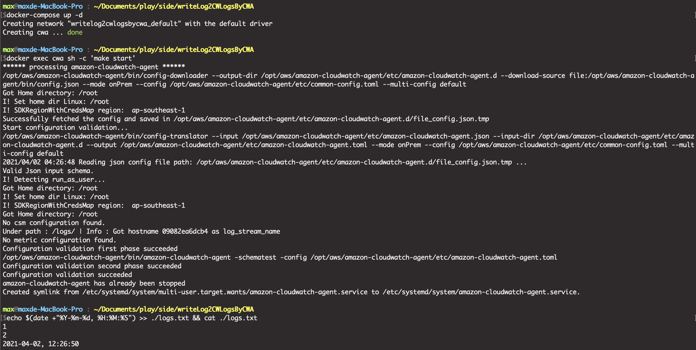
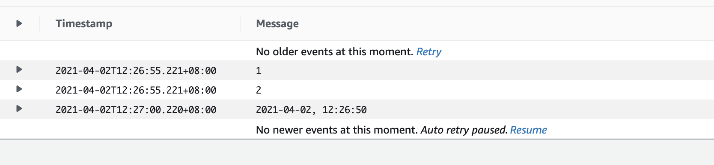

# Purpose
- Write logs to CWLogs by CloudWatch Agent from On-Premise.

## Env setting
1. Prerequisite : create a Log group at CloudWatch Logs
2. Update `./config.json`
    - Set the `log_group_name`
2. Update `./credentials`
    - Can't use environment parameters, must specify the profile name is `AmazonCloudWatchAgent`

## Operation
1. `docker-compose up -d`
2. `docker exec cwa sh -c 'make start'`
3. Write something into `./logs.txt`
    - `echo $(date +"%Y-%m-%d, %H:%M:%S") >> ./logs.txt && cat ./logs.txt` 

## Command
- start   : `docker exec cwa sh -c 'make start'`
- stop    : `docker exec cwa sh -c 'make stop'` 
- status  : `docker exec cwa sh -c 'make status'`
- loginfo : `docker exec cwa sh -c 'make loginfo'`
- version : `docker exec cwa sh -c 'make version'`

